# Plots: Figure Captions

本文档为 `plots/` 目录下所有图件提供论文式标题与图注，便于在报告或学术论文中直接引用。

## Main models

### Figure 1. Confusion matrix of Random Forest (default threshold = 0.5)

该图展示 Random Forest 攻击分类器在默认决策阈值 0.5 下的混淆矩阵，用于刻画成员样本（member）与非成员样本（non-member）的分类结果分布。矩阵对角线元素反映正确分类数量，非对角线元素对应误报（false positive）与漏报（false negative），用于直观分析类别偏置与错误类型。

### Figure 2. Confusion matrix of Random Forest (tuned threshold)

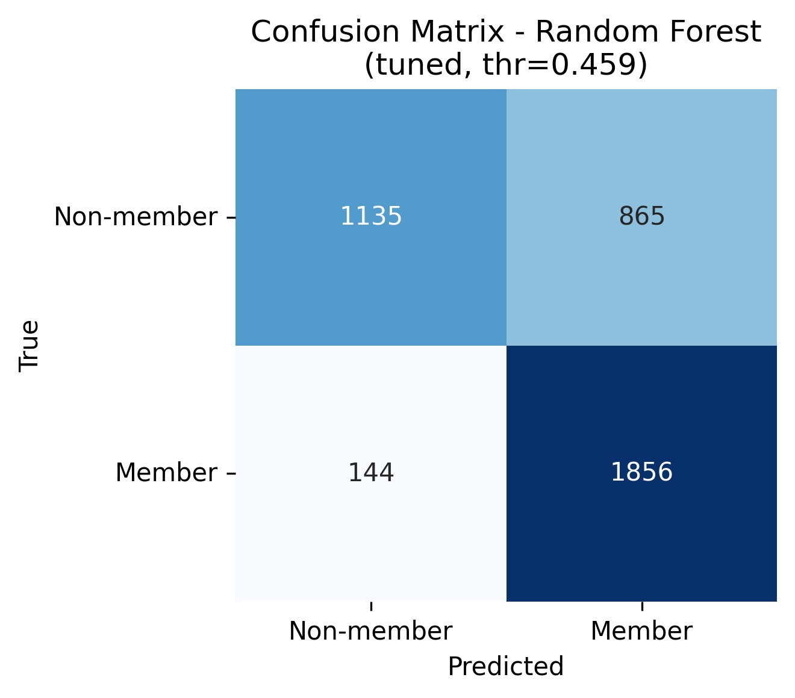

该图给出 Random Forest 在阈值调优后的混淆矩阵，用于与默认阈值设置对比其误报/漏报权衡变化。阈值调优通常以最大化某一目标（如 F1、Youden’s J、或满足特定 TPR@FPR 约束）为准，从而改变决策边界并影响混淆矩阵结构。

### Figure 3. Confusion matrix of threshold-based attack using target loss (default threshold = 0.5)

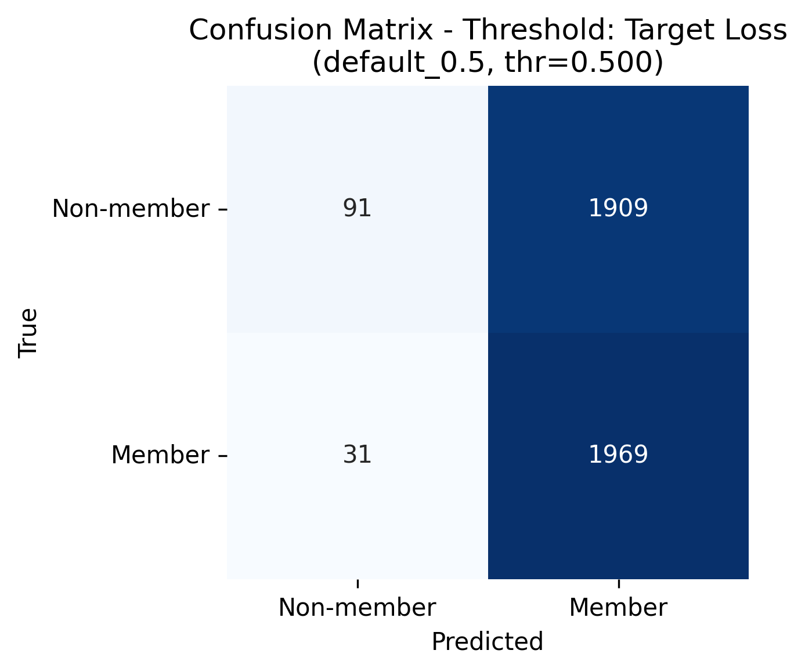

该图展示基于目标模型损失（target loss）的阈值攻击在默认阈值 0.5 下的混淆矩阵。该方法以样本在目标模型上的损失/置信度作为判别统计量，通过阈值将样本划分为成员与非成员，是传统 MIA 的基线之一。

### Figure 4. Confusion matrix of threshold-based attack using target loss (tuned threshold)

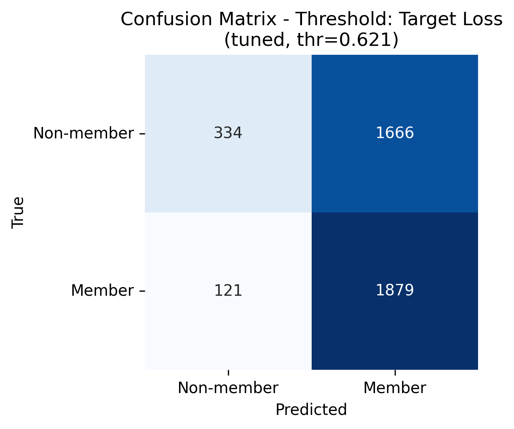

该图为阈值调优后的 target-loss 基线攻击混淆矩阵，展示在不同阈值设定下误报率与漏报率的变化。该对比有助于说明“固定阈值”与“性能最优阈值”在实际部署风险（隐私泄露报警与漏检）上的差异。

### Figure 5. Confusion matrix of XGBoost (Full feature set, default threshold = 0.5)

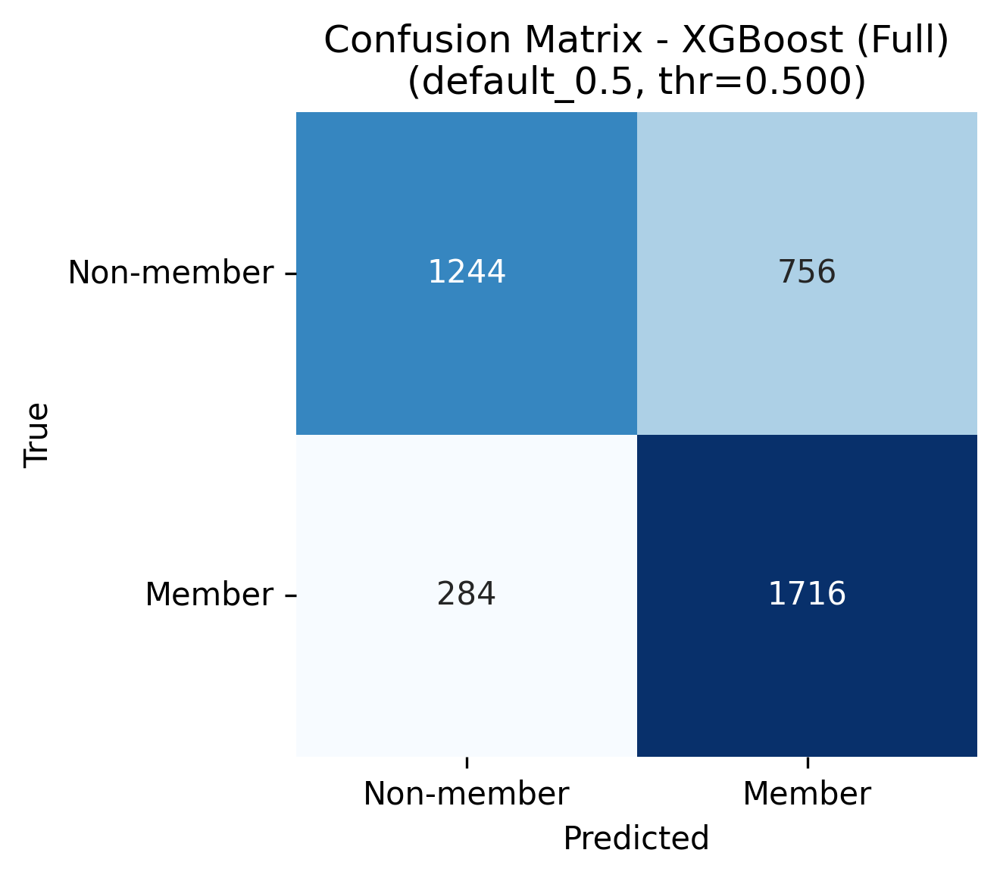

该图展示使用完整特征集（Full）的 XGBoost 攻击分类器在默认阈值 0.5 下的混淆矩阵，用于评估特征驱动的判别能力。与简单阈值基线相比，梯度提升树可学习非线性特征交互，从而在特定误报约束下提升检测率。

### Figure 6. Confusion matrix of XGBoost (Full feature set, tuned threshold)

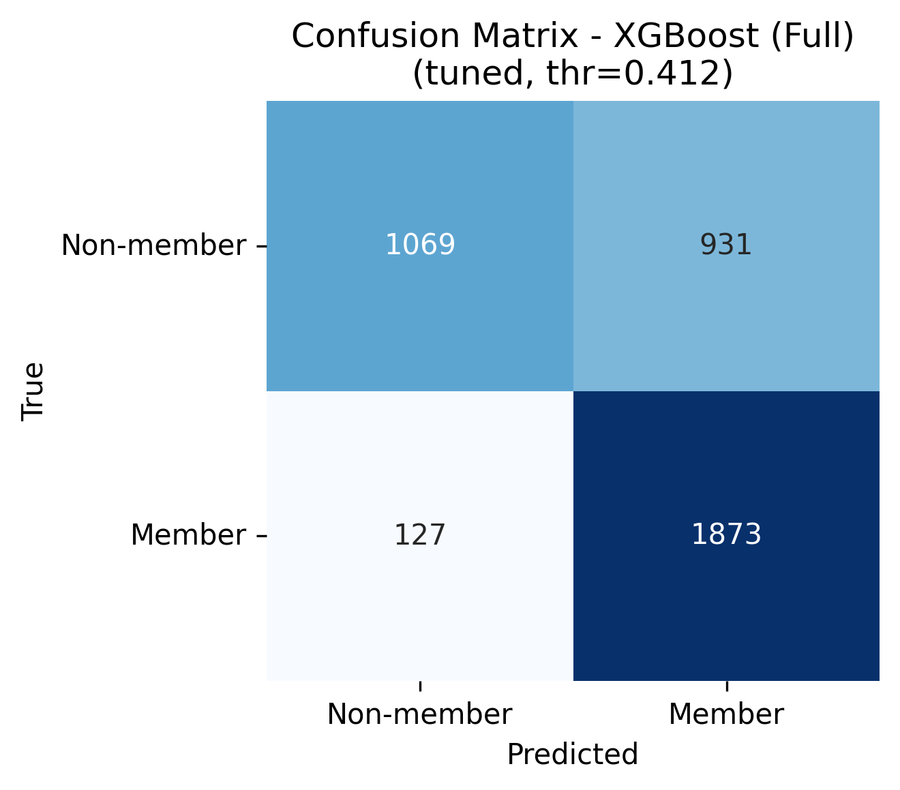

该图给出阈值调优后的 XGBoost（Full）混淆矩阵，用于展示在相同模型分数输出下，通过改变决策阈值可以获得不同的安全-效用折中（例如在降低 FPR 的同时尽量保持 TPR）。

### Figure 7. ROC curves of main-model attacks

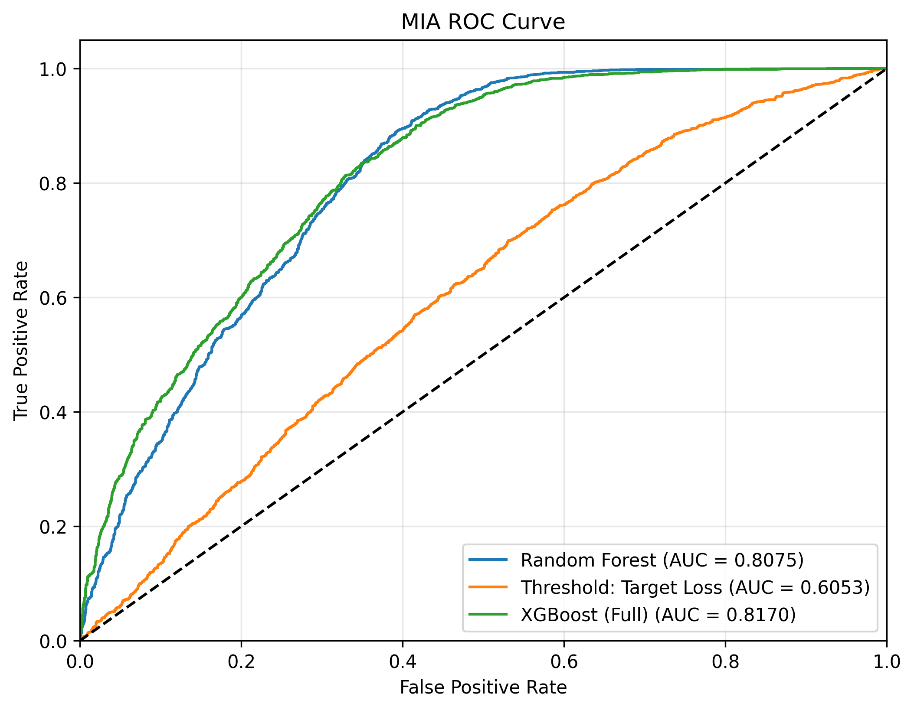

该图给出主模型设置下不同攻击方法的 ROC 曲线（TPR 对 FPR），用于衡量在不同阈值下的整体可分性。曲线越靠近左上角表示在较低误报率下获得更高命中率；曲线下面积（AUC）可作为阈值无关的综合指标。

### Figure 8. ROC curves of main-model attacks (log-scaled FPR)

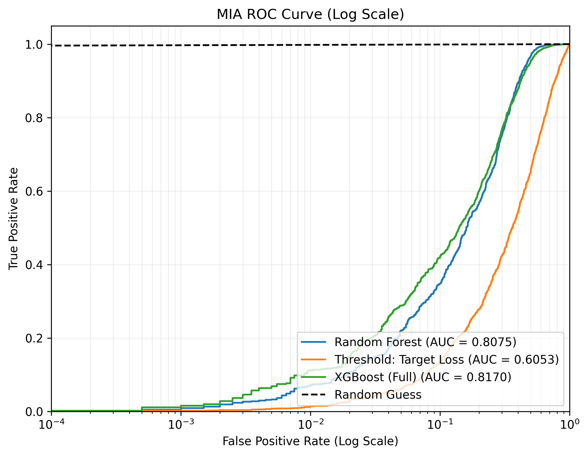

该图在对数尺度下展示 ROC 曲线，强调低误报率区域（例如 FPR \(\le 10^{-2}\) 或更低）下的性能差异。该视角更贴近隐私攻击评估的安全场景，因为实际系统通常要求极低误报率。

### Figure 9. Precision–Recall (PR) curves of main-model attacks

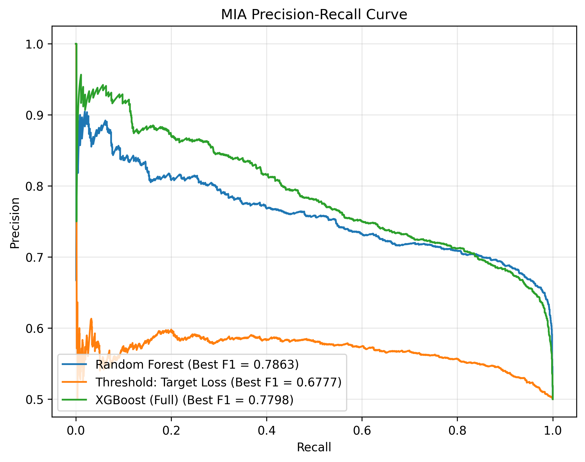

该图给出 PR 曲线（Precision 对 Recall），用于在类别不平衡或关注正类质量（成员判定准确性）时评估攻击性能。PR 曲线在低召回或高召回区域的变化可揭示模型在“少报但准”与“多报但可能误报”之间的取舍。

### Figure 10. DET curve of main-model attacks (log–log)

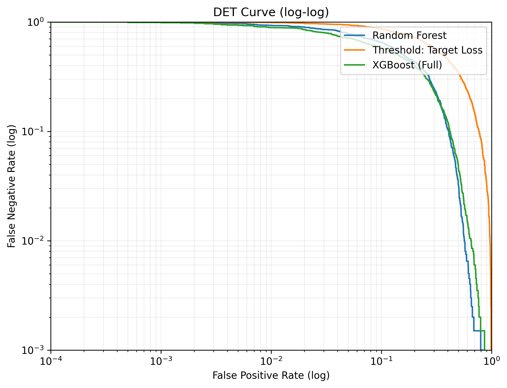

该图为 DET 曲线（通常以 FPR 与 FNR 关系呈现），并采用对数-对数尺度突出极低错误率区域的差异。DET 曲线在安全评估中常用于对比不同方法在严格约束下的整体误差水平。

### Figure 11. Threshold–metric curve of Random Forest

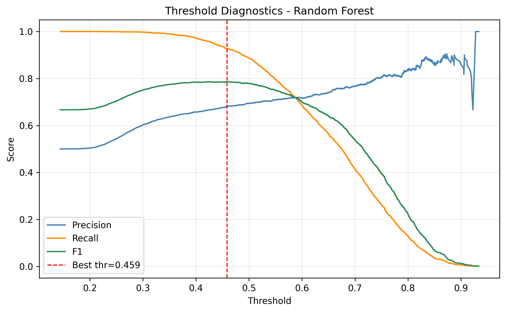

该图展示 Random Forest 输出分数在不同决策阈值下的指标变化（例如 TPR/FPR/Precision/Recall/F1 等，具体以图中标注为准）。该图可用于选择与业务约束匹配的阈值，例如在限定 FPR 的情况下最大化 TPR，或最大化综合指标。

### Figure 12. Threshold–metric curve of target-loss threshold attack

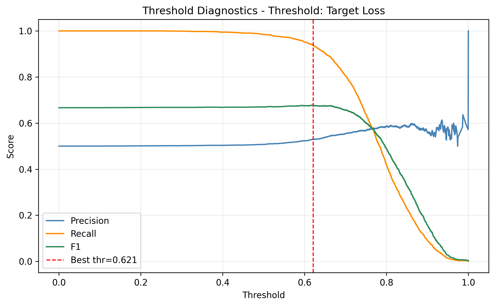

该图展示基于 target loss 的阈值攻击在不同阈值设定下的性能曲线，用于说明简单统计量也会呈现明显的阈值敏感性。该结果可为“默认阈值是否合理”提供依据，并用于确定最优或安全阈值区间。

### Figure 13. Threshold–metric curve of XGBoost (Full feature set)

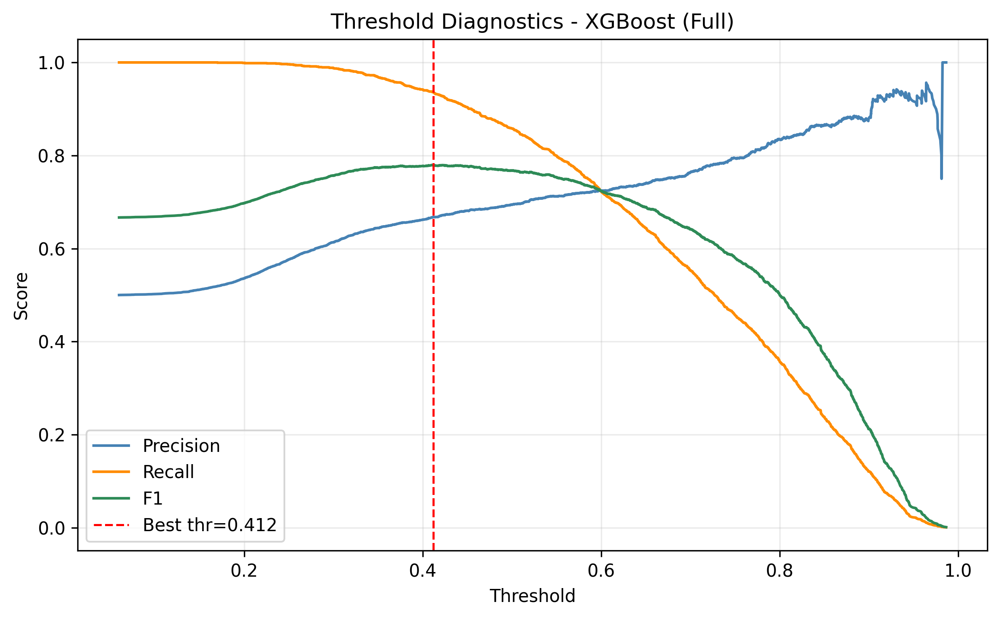

该图给出 XGBoost（Full）在不同阈值下的指标变化，展示模型分数的可校准性与阈值选择空间。曲线形态可反映模型输出分数分布的分离程度：分离越清晰，通常越容易在低 FPR 区域保持较高 TPR。

### Figure 14. Metric summary of main-model attacks

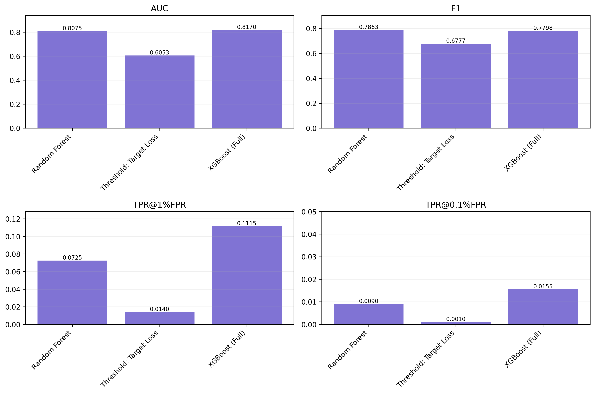

该图汇总主模型设置下多种攻击方法的核心评估指标（例如 Accuracy、AUC、Precision、Recall、F1、TPR@FPR 等，具体以图中列项为准）。该汇总便于在单一视图中比较不同攻击策略的总体优劣与侧重点。

### Figure 15. TPR comparison bar chart of main-model attacks

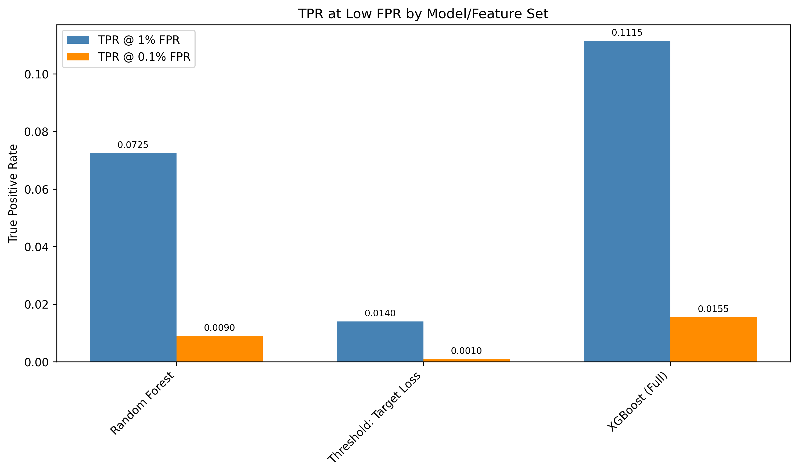

该图以柱状图形式对比不同攻击方法在特定误报率约束（或特定阈值策略）下的 TPR 表现（以图中设定为准）。在隐私风险评估中，TPR@low-FPR 更能反映攻击在“几乎不误报”的情况下能泄露多少成员信息。

### Figure 16. Feature importance of Random Forest (top-20)

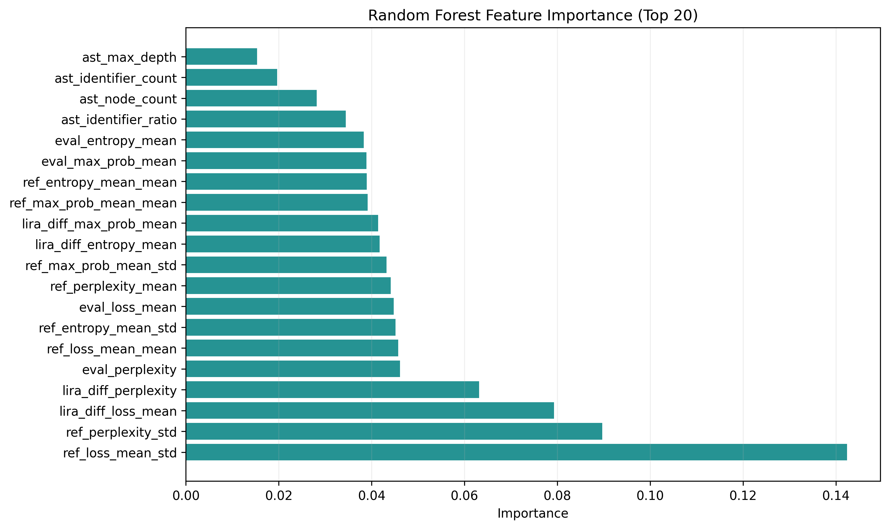

该图展示 Random Forest 对前 20 个最重要特征的相对重要性排序（重要性定义以模型实现为准，例如基于 impurity decrease 或 permutation）。该结果用于解释攻击模型依赖哪些统计量进行成员判别，并为特征消融与简化提供依据。

### Figure 17. Feature importance of XGBoost (top-20)

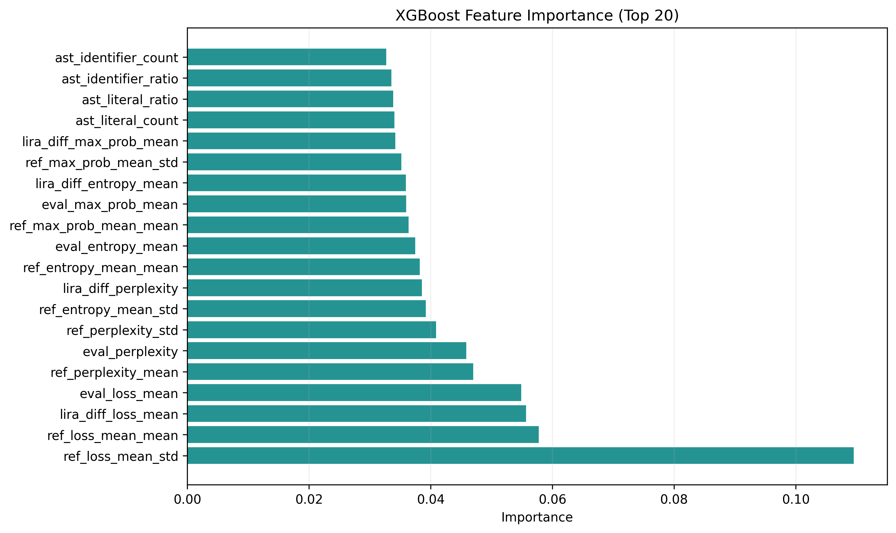

该图展示 XGBoost 对前 20 个特征的重要性排序（例如 gain/weight/cover 等度量之一，具体以训练配置为准）。与随机森林对比可揭示不同树模型在特征利用上的一致性与差异，从而提高结论的稳健性。

## Ablation

### Figure 18. Confusion matrix of ablation setting 1: Basic (Target-only) (default threshold = 0.5)

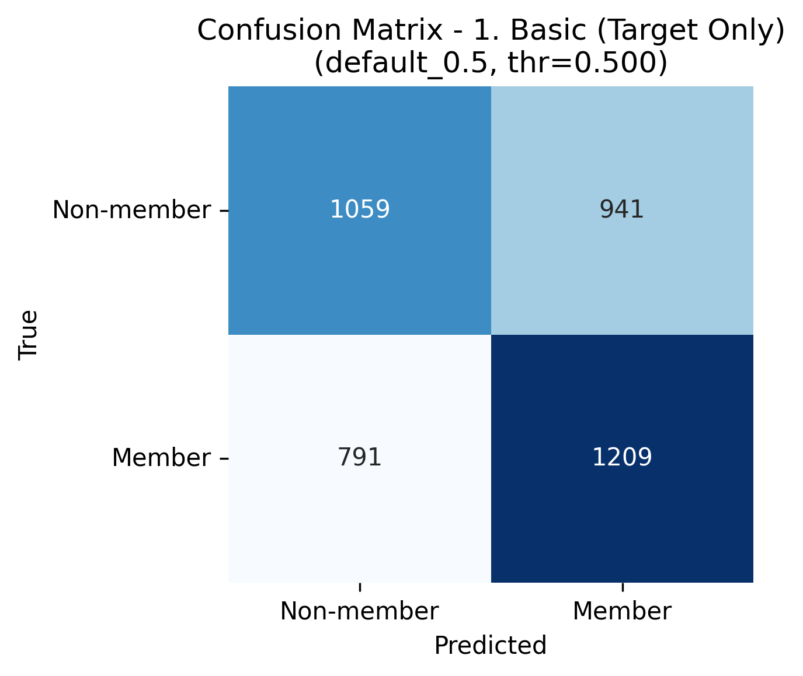

该图对应消融实验设置 1（Basic：仅使用目标模型相关信号）的混淆矩阵，用于评估在缺少更丰富特征（例如嵌入差异或 LiRA 类统计量）时的攻击性能。该结果用于建立最简特征集下的基线，并量化后续增强模块的贡献。

### Figure 19. Confusion matrix of ablation setting 1: Basic (Target-only) (tuned threshold)

该图为设置 1 的阈值调优版本混淆矩阵，展示在相同特征条件下，通过阈值选择可获得的最优或更符合约束的误差权衡。对比 Figure 18 可体现该设置下“阈值可调空间”的大小。

### Figure 20. Confusion matrix of ablation setting 2: Basic + AST features (default threshold = 0.5)

该图对应设置 2（在 Basic 基础上加入 AST 结构特征）的混淆矩阵，用于检验代码结构统计量是否能提升成员判别能力。若混淆矩阵改进有限，通常意味着该类特征与成员性关联较弱或难以捕捉目标模型记忆效应。

### Figure 21. Confusion matrix of ablation setting 2: Basic + AST features (tuned threshold)

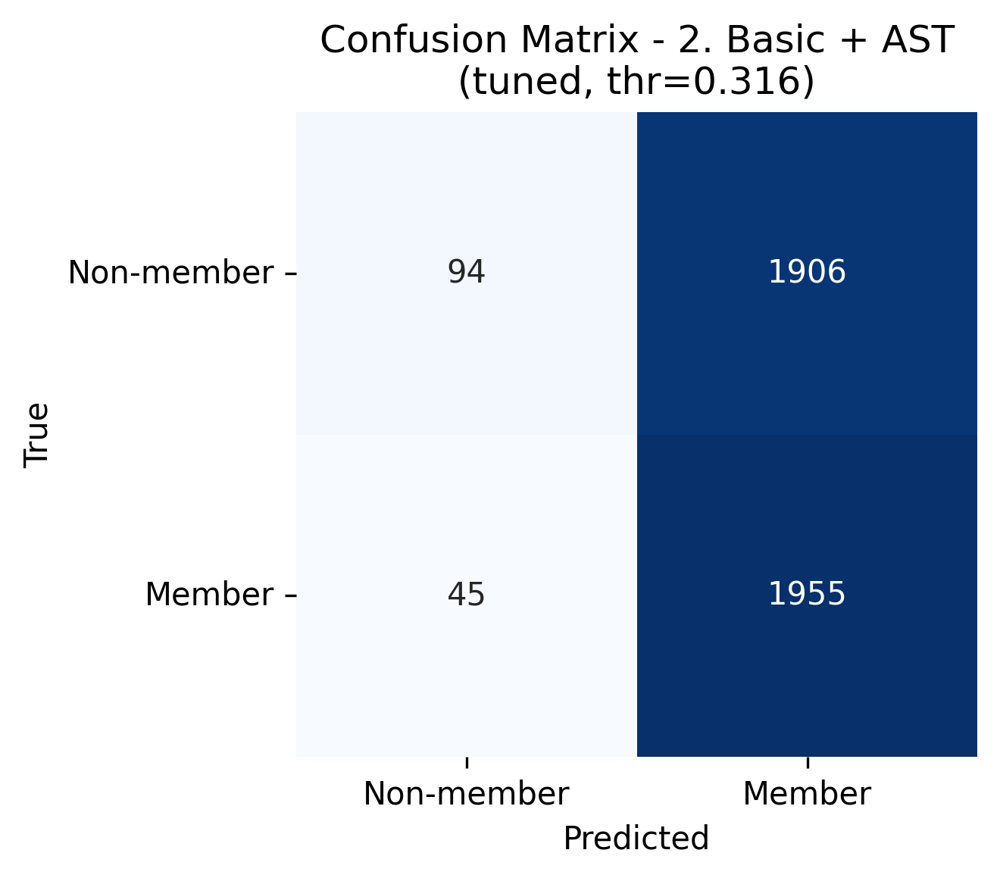

该图为设置 2 的阈值调优混淆矩阵，用于进一步验证 AST 特征在最优阈值下的潜在增益。与 Figure 20 对比可评估“阈值选择”是否掩盖了特征改进效果。

### Figure 22. Confusion matrix of ablation setting 3: Basic + embedding features (default threshold = 0.5)

该图对应设置 3（在 Basic 基础上加入目标模型嵌入表征特征）的混淆矩阵，用于分析隐藏表示是否包含可区分成员/非成员的信号。嵌入特征往往能捕捉模型对特定样本分布的内部响应差异，从而改善攻击可分性。

### Figure 23. Confusion matrix of ablation setting 3: Basic + embedding features (tuned threshold)

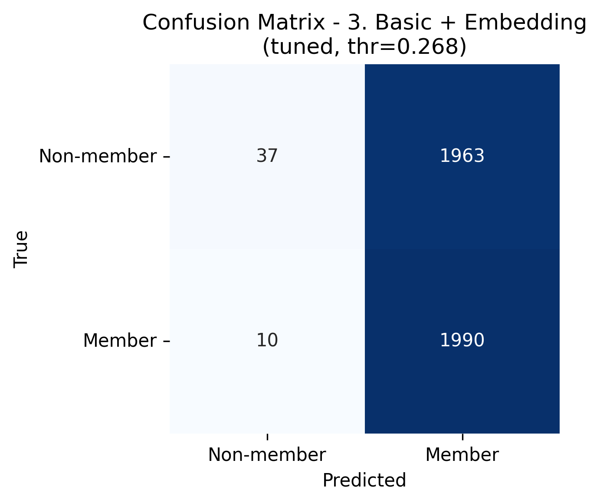

该图为设置 3 的阈值调优混淆矩阵，展示引入嵌入特征后的最佳误报/漏报权衡。若与 Basic 设置相比非对角线显著下降，说明嵌入表征可有效增强成员信息泄露的可检测性。

### Figure 24. Confusion matrix of ablation setting 4: Full (LiRA + embedding + AST) (default threshold = 0.5)

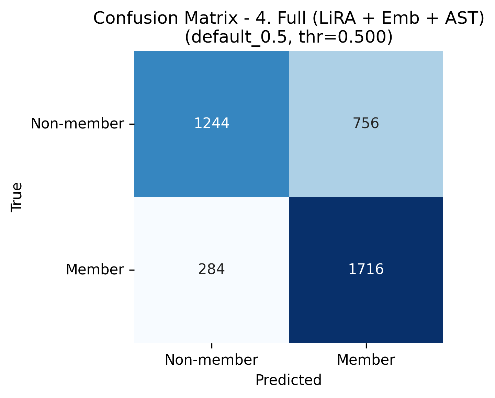

该图对应完整设置（Full：融合 LiRA 差异信号、嵌入表征与 AST 特征）的混淆矩阵，用于评估多源特征融合对攻击性能的综合提升。该设置旨在同时利用“输出层统计量”和“表示层差异”，增强对成员性线索的捕获。

### Figure 25. Confusion matrix of ablation setting 4: Full (LiRA + embedding + AST) (tuned threshold)

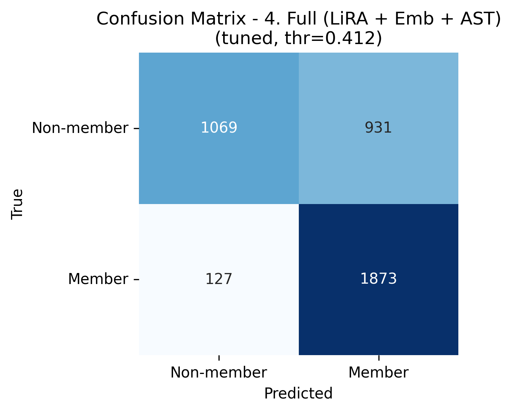

该图为完整设置的阈值调优混淆矩阵，用于展示在最佳阈值策略下的最终分类误差结构。该结果通常代表所提出攻击管线在该实验设定中的上限性能，并可用于与主模型实验的最优结果对齐比较。

### Figure 26. ROC curves of ablation study

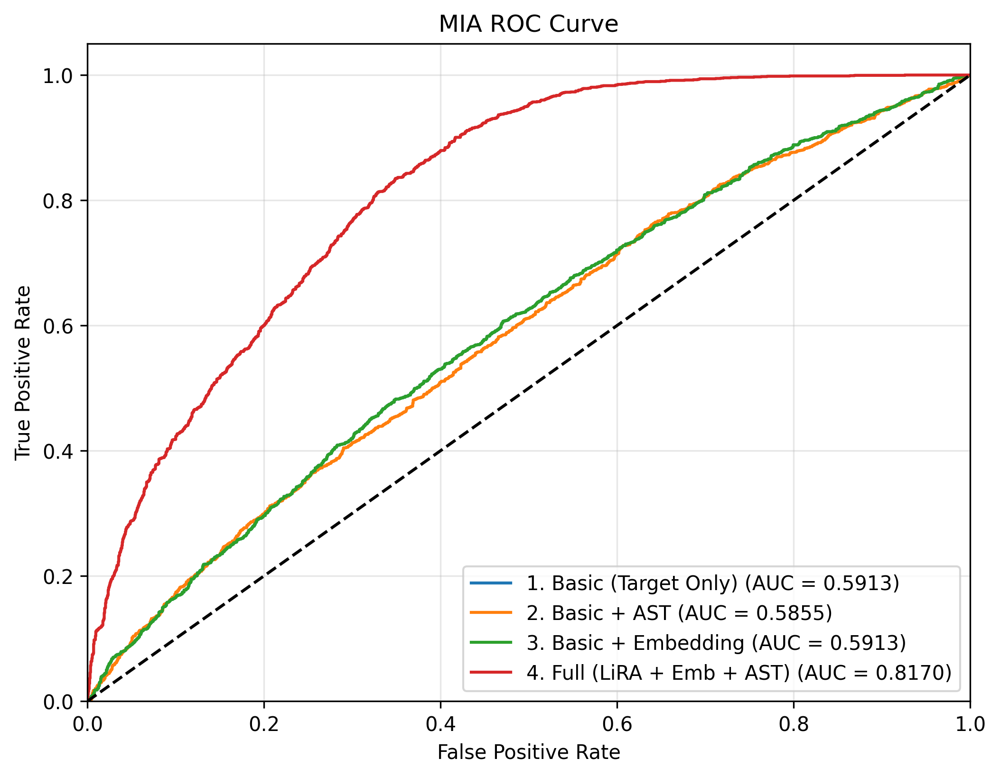

该图展示不同消融设置下的 ROC 曲线，用于定量比较各特征模块对阈值无关可分性的贡献。曲线整体上移或在低 FPR 区域显著改善，通常表明新增特征对隐私泄露信号具有增益。

### Figure 27. ROC curves of ablation study (log-scaled FPR)

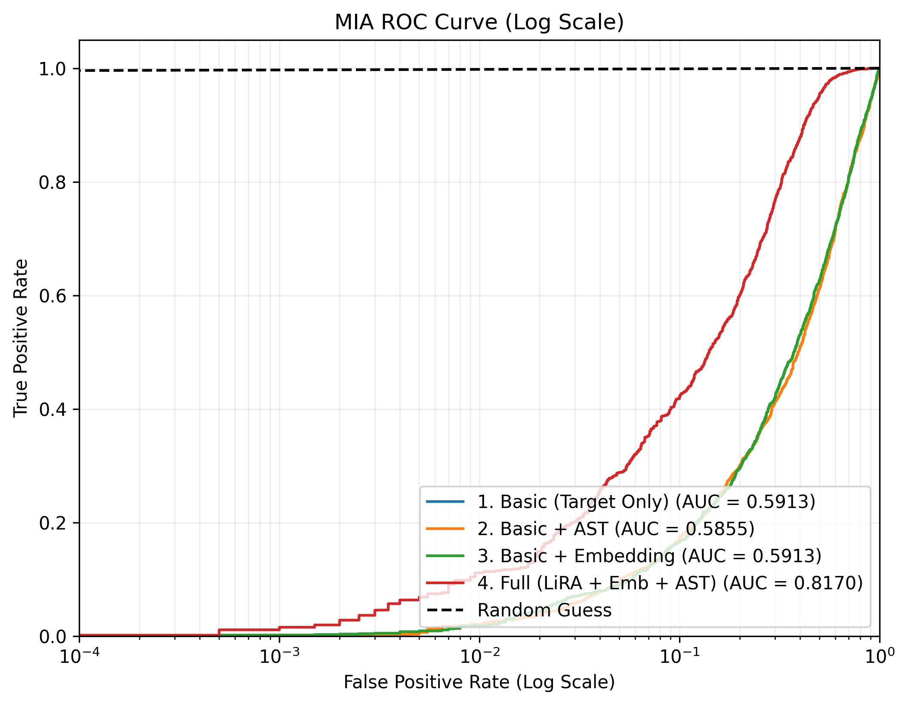

该图在对数尺度下展示消融实验的 ROC 结果，强调低误报率区间的性能差异。该分析对隐私攻击更关键，因为低 FPR 对应“误报成本极高”的实际应用场景。

### Figure 28. Precision–Recall (PR) curves of ablation study

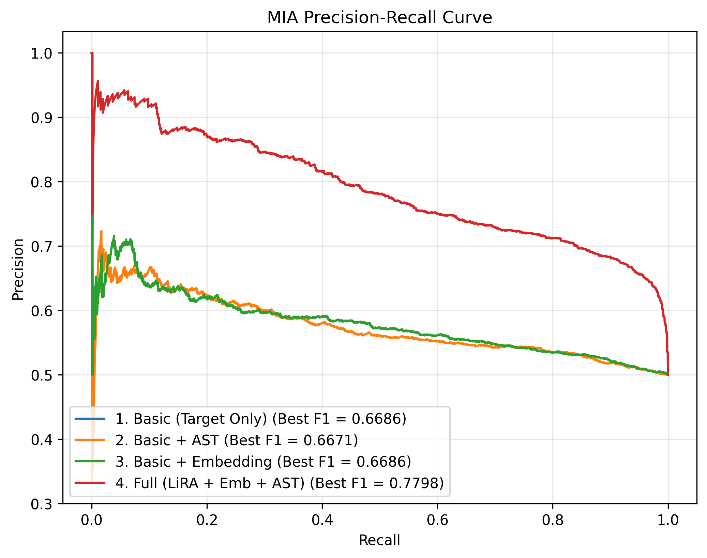

该图给出消融设置下的 PR 曲线，辅助评估在正类（成员）判定质量方面的变化。若引入某模块显著提升高 Recall 区域的 Precision，意味着在提高检出率时仍能控制误报。

### Figure 29. DET curve of ablation study (log–log)

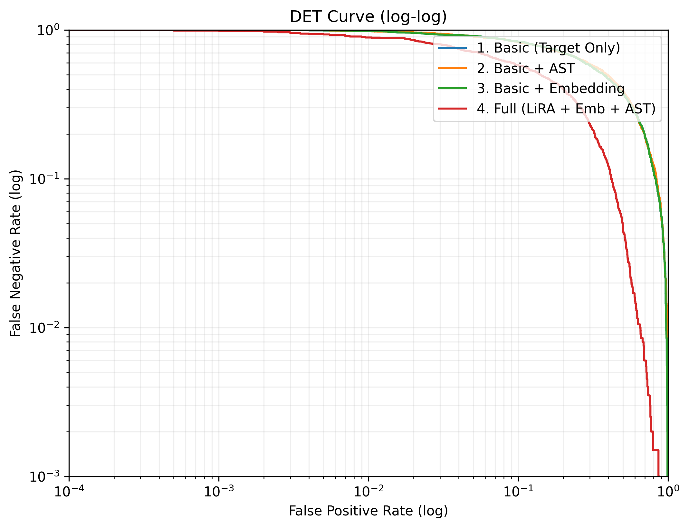

该图为消融实验的 DET 曲线，用于比较不同设置在整体错误率层面的表现。曲线越靠近原点表示在同时降低误报与漏报方面更具优势。

### Figure 30. Threshold–metric curve of ablation setting 1: Basic (Target-only)

该图展示设置 1 在不同阈值下的指标变化，用于说明仅依赖目标模型信号时阈值选择的敏感性与可操作区间。该曲线可作为“最简攻击”在不同风险偏好下的部署参考。

### Figure 31. Threshold–metric curve of ablation setting 2: Basic + AST features

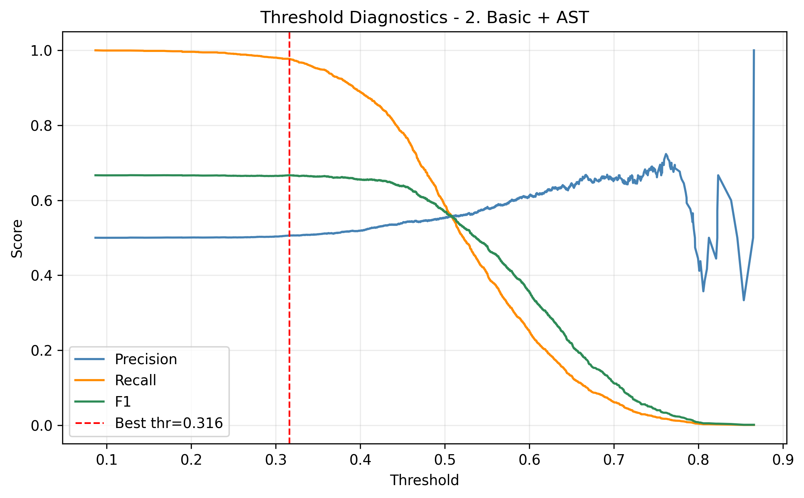

该图展示引入 AST 特征后的阈值-指标关系，用于判断 AST 模块是否带来更稳定或更优的阈值区域。若曲线整体无明显提升，意味着结构特征对该任务贡献有限。

### Figure 32. Threshold–metric curve of ablation setting 3: Basic + embedding features

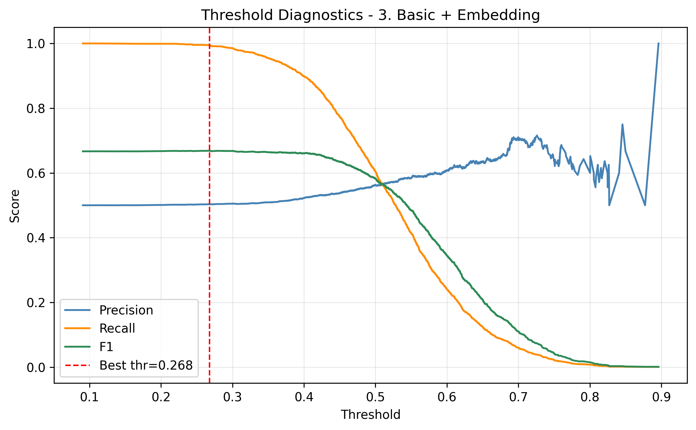

该图展示引入嵌入特征后的阈值-指标关系，用于评估表示层信息是否使模型在较宽阈值范围内保持较高性能。更平坦的性能平台通常意味着更稳健的阈值选择。

### Figure 33. Threshold–metric curve of ablation setting 4: Full (LiRA + embedding + AST)

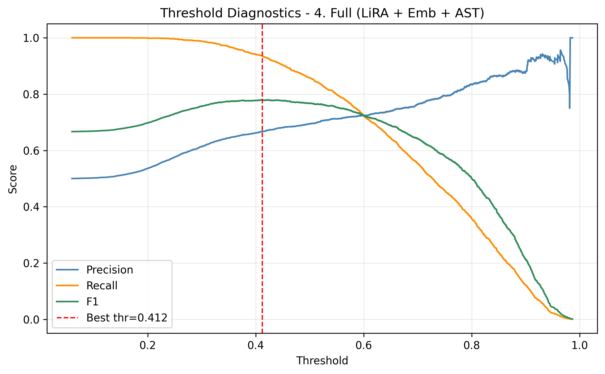

该图给出完整特征融合设置下的阈值-指标曲线，用于展示最强设置在不同阈值策略下的性能上界与稳定性。该结果可用于确定满足特定误报约束的推荐阈值范围。

### Figure 34. Metric summary of ablation study

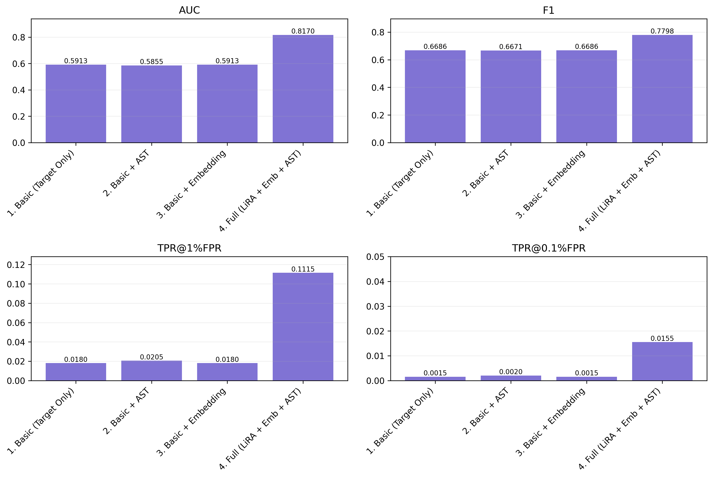

该图汇总消融实验各设置的关键指标（以图中列项为准），用于在单一视图中对比不同特征模块的边际贡献。该汇总通常用于支撑“所提出模块有效性”的结论。

### Figure 35. TPR comparison bar chart of ablation study

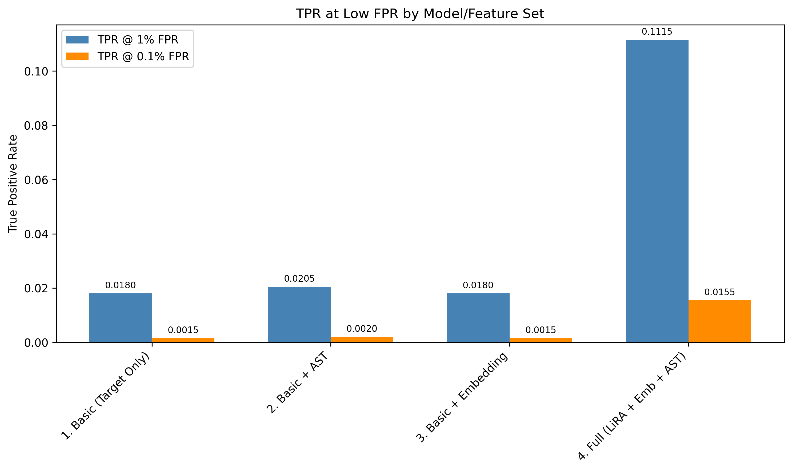

该图以柱状图对比不同消融设置在指定约束下的 TPR 表现（以图中设置为准），用于突出关键模块在低误报约束下的增益。该指标在隐私攻击评估中更能反映实际泄露风险。

## Overall (root-level)

### Figure 36. Overall ROC curve (root-level summary)

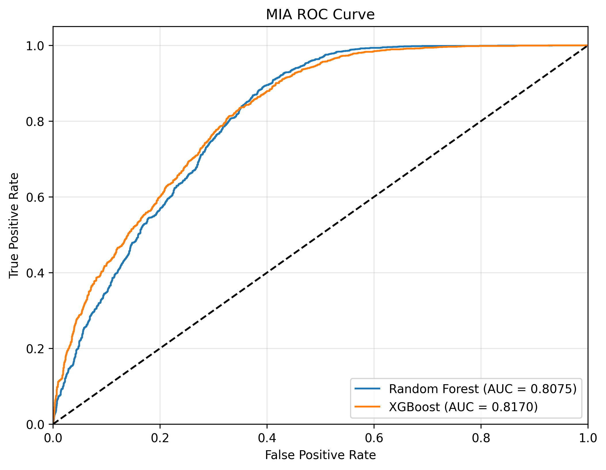

该图为 `plots/` 根目录下的 ROC 汇总图，通常用于提供全局视角的攻击性能对比（例如跨实验设置或跨模型的综合曲线）。该结果可作为论文主文中的“总体趋势”图件，并与分组图（Main models / Ablation）互为补充。

### Figure 37. Overall ROC curve with log-scaled FPR (root-level summary)

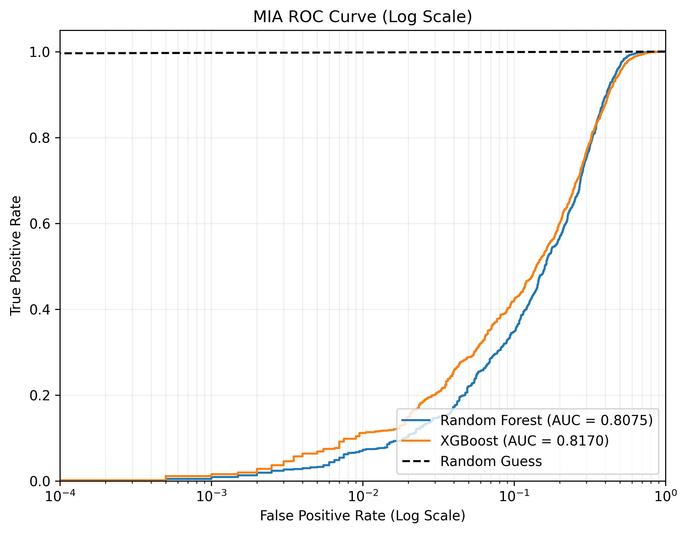

该图为根目录下的对数尺度 ROC 汇总图，强调低误报率区域的总体差异。该视角更适合在论文中报告安全关键区间（low-FPR）的性能。

### Figure 38. Overall PR curve (root-level summary)

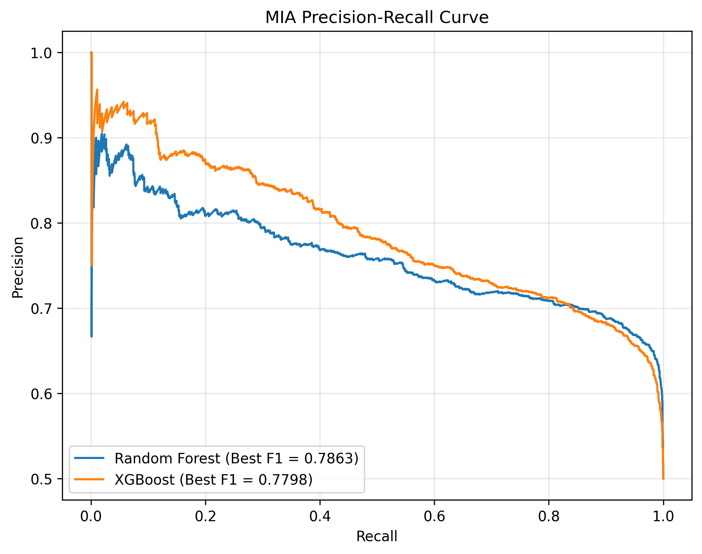

该图为根目录下的 PR 汇总图，用于从 Precision–Recall 视角总结整体攻击性能。该图通常用于补充 ROC 的阈值无关评价，尤其适用于成员/非成员比例不均衡的实验设置。
